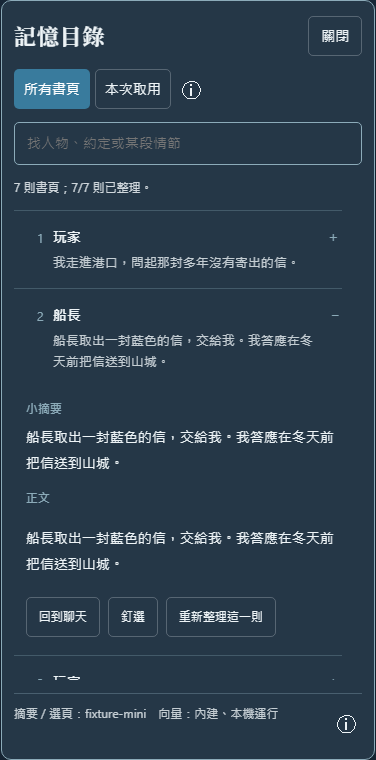

# Folio 書頁記憶

SillyTavern 自動記憶擴充。正文是書頁，小摘要是目錄：先查目錄，再取回完整正文。

不用另一個後端插件、不用 Ollama、不用額外視窗，也不用手動下載向量模型。

## 安裝與入口

酒館「擴充功能 → 安裝擴充功能」貼上：

```text
https://github.com/ab003317/sillytavern-folio
```

重新整理酒館，從 **輸入欄魔法棒 → 書頁記憶** 開啟。預設只自動整理開啟後新生成的角色回覆；現有舊聊天絕不自動掃描，只會在你按「一鍵重新整理全部」後處理。可沿用酒館已有連線，也可在記憶助手中填寫獨立 API。更新、停用、卸載使用酒館原生擴充管理，不必重新安裝。

安裝含約 24 MB 中文模型、約 11 MB 推理程式，是普通 Git 檔案，不是 LFS 指標。瀏覽器從你的酒館伺服器載入，沒有 CDN / Hugging Face 執行期下載。

若 Anima 仍啟用，Folio 會暫停並提供原生停用 Anima 的按鈕，避免重複處理歷史。其他歷史整理插件也應避免同時接管；不刪它們的資料、不解除已有隱藏訊息。

## 平常直接聊天

面板分四頁，資料自動更新。每個重要區域都有可點擊的 ⓘ 說明。

- **運行**：明確分開「舊聊天等待玩家手動整理」與「新回覆自動整理進度」，並顯示摘要完成率、本機向量就緒率、最近現存回覆的取用摘要、一鍵重整和最近動作。圓環按正文頁數計算，沒有正文時顯示「—」。
- **書頁目錄**：搜尋標題、人物、摘要、正文；對照玩家背景、小摘要、清理後正文與原始訊息。可釘選、修改摘要、重做單頁。
- **本次取用**：直接顯示最近發送前核對到的正文、玩家背景、選取理由及全文。沒有試跑操作；較早紀錄從選單查看，候選目錄和未核對到的內容預設折疊。
- **記憶助手**：分別填寫「總結模型」與「提取模型」，各自選來源、網址、金鑰及模型，或沿用既有酒館連線；獨立保存、取得列表、測試。不暴露向量／採樣參數。



## 手動重新整理

「運行」儀表下方和「書頁目錄」頂端都有 **一鍵重新整理全部**。它會重新呼叫已保存的總結模型，重做目前聊天全部正文的摘要（包含人工修改過的摘要），再更新向量索引；不是刷新畫面或重新讀取舊摘要快取，可能產生 API 費用。正文與玩家輸入不變，釘選保留。

單頁閱讀區頂端的 **重新整理此頁** 只重做指定頁，優先於較早的普通待整理頁。手動重整獨立於「自動記憶」開關：關閉自動時也會執行，不會擅自打開自動功能。若正文正在生成，按鈕會等待生成結束才可操作。

面板顯示排隊、正在整理的頁／段數、摘要與向量進度、完成和失敗原因。已保存任務可在刷新後繼續；同一批任務未結束不能重複提交。失敗時保留舊摘要供查看，按「立即重試」再嘗試，或「停止本次重整」恢復尚未完成頁的原摘要；已完成頁保留新結果。自動功能原本開啟時，停止手動任務後普通自動整理仍會繼續。

重整使用新的任務版本，舊快取或慢回覆不能冒充重整結果。刪除／變更過的頁會從任務中略過，不會套到移位的樓層；切換聊天取消當前請求，回到原聊天後繼續已保存的任務。向量失敗時會明示暫用文字檢索，不重複呼叫總結模型。相同摘要可沿用本機向量快取。

## 記憶流程

1. 一則角色正文是一頁；玩家輸入是這頁的背景，不各自產生摘要頁。移除已知思考、摘要、狀態欄、程式區塊，識別明確正文標籤；原聊天不改文。
2. 每頁生成標題與小摘要，記住人物、因果、關係、約定、伏筆。長正文按內容長度拆段，逐段保存，沒有「固定每 30 樓」門檻。
3. 內建 BGE-small-zh-v1.5 int8 / 512 維，對小摘要建立本機向量，長摘要再切塊。
4. 回覆前以語意向量 + BM25 找候選，再讓助手只讀候選小摘要、選出需要的舊正文；可以一頁都不選。
5. 取回選中頁的完整正文及當時玩家輸入，與近期完整回合按時間排序去重，透過標準 `generate_interceptor` 放入預設 **Chat History**。不是把摘要塞進系統提示或世界書。

歷史目標為酒館傳入可用 prompt tokens 的 45%，上限 14k；近期回合和舊頁共用容量。最近完整回合優先保留，可能超過目標；舊頁全文放不下就略過，不截成假原文。酒館仍按角色卡、預設、世界書佔用後的剩餘容量裁剪。這不是自動探測供應商實際模型上限。

舊頁未完成摘要時，保留原歷史並標示「舊聊天未整理」；不發出摘要請求，也不用正文摘錄冒充目錄。向量暫不可用會用文字檢索，助手選頁失敗會用匹配備援，介面如實提示。

只有開啟後新生成的回覆進入自動任務時，輸入區上方才會出現不搶焦點的進度浮層，顯示當前頁／分段、摘要頁數與向量頁數。打開舊聊天不彈窗。「查看進度」直接打開運行頁；完成提示短暫顯示後收起，失敗則保留錯誤和「立即重試」。進度只根據這批新回覆的摘要與向量計算，不是假動畫。

## 模型與費用

向量是真的內建、本機 WebAssembly 運算，不使用 Ollama、向量 API 或新端口。關閉頁面終止 worker，閒置兩分鐘釋放模型。以中文為主，不宣稱所有語言品質相同。

總結／提取不是內建大語言模型。在魔法棒「記憶助手」分別填寫兩個用途：總結模型寫標題、小摘要；提取模型讀候選小摘要選正文。每欄獨立保存和測試，不共用隱藏設定，不改主聊天模型。已選模型失敗時不會偷偷改叫主模型。

來源有 OpenAI、Claude (Anthropic)、OpenRouter、Google Gemini、Mistral、DeepSeek、自訂 OpenAI 相容接口，以及「酒館現有連線」。選來源會帶入官方 API 基址；中轉站可改地址，使用 OpenAI 格式的中轉應選「自訂（OpenAI 相容）」，不是按模型品牌選 Claude／Gemini 原生格式。

填網址和金鑰後可「取得模型列表」，從列表選擇或手填模型 ID，再保存和測試。取得列表使用尚未保存的表單，不改正在運行的連線；列表成功不代表有該模型的使用權，測試按鈕會實際驗證摘要／選頁。API 基址支援自訂路徑，貼上 `/chat/completions`、`/messages`、`/models` 時移除該尾段；不接受帶金鑰的 query 網址。Gemini 走酒館原生 v1beta 適配。

新填的獨立 API 金鑰保存在酒館帳號設定，**不是加密金鑰庫**，帳號設定／備份及同頁插件可讀取；不要公開分享含金鑰的備份。輸入框不回填已存明文，留空只沿用相同來源和網址的金鑰；換來源／網址需要重新填。自訂免驗證接口可留空，也可勾選不使用已存金鑰後保存。不会讀取、替換或輪換主聊天的服務商金鑰。關閉面板重新遮罩手動顯示的金鑰。

所有 API 請求透過酒館原生後端，不從瀏覽器直接跨域，不需要額外代理服務。`localhost` 指酒館伺服器所在電腦；遠端 API 請使用 HTTPS。模型列表 30 秒超時，生成 60 秒超時。取消或切來源後的舊列表不會蓋掉新表單。

從舊版更新會把已有助手設定一次性帶入兩欄，之後互不影響；沒有舊設定時先帶入既有的小模型連線或目前聊天模型，仍可明確修改。模型名稱留空時不發請求。向量是內建的第三種用途，不需要填寫。

額外請求可能收費：開啟後每段新正文一次摘要；玩家按一鍵重整時，每段舊正文也會重新請求；需要舊頁時通常再有一次選頁。僅打開或切換到舊聊天不發出摘要請求。助手測試也是真實短請求；查看已保存的取用紀錄不呼叫模型。暫停新回覆自動記憶後，在關閉期間收到的回覆重新開啟時也不會補做；手動重整與連線測試仍可執行。只在酒館頁面開啟時處理新回覆，不是伺服器離線排程。

## 可靠性與邊界

- SHA-256 核對正文、玩家背景、角色和清理版本；改文或換 swipe 只重做變動頁。0.1 已完成且正文仍相符的角色摘要會沿用。
- 每段都有 IndexedDB 完成記錄，刷新續做。摘要保存在訊息 `extra.folio_memory`，向量不寫進聊天檔。單一瀏覽器多視窗使用交易鎖；不同裝置不共享這把鎖。
- 切聊天、開始生成、取消會中止舊工作。總結、提取及向量工作均有 60 秒超時；取消不等待超時，背景失敗退避重試。
- 刪除中間／尾部樓層後，候選目錄只從目前仍存在的正文建立；清理失效摘要快取並取消待發送選頁。刪玩家輸入會使受影響頁的背景摘要失效，後續未變動的完整頁沿用。
- 已發送取用快照與待發送選頁分開：每段聊天在此瀏覽器 IndexedDB 保存最近 20 次，并与随后生成的角色回复内容指纹绑定。只有对应回复仍存在的记录会显示；删除最新回复后，“最近取用”自动回退到上一笔仍存在的旧回复记录，未完成／失败的生成不会抢占最近位置。来源正文被删除或改文时另行标明状态，楼层前移不拿旧楼号猜。快照只供查看，不会进入之后检索；清除网站资料会移除记录，不跨设备同步。旧版未绑定的快照只在能从紧邻的角色回复安全推断时显示。
- 管理操作按訊息物件與內容指紋核對，不按舊樓號猜。提取期間刪除會取消該次生成；查頁後、發送前才刪除，也會停止原生生成並阻止那份過期請求序列化。已在刪除前送到服務商的請求無法撤回，但回來的過期結果不會保存／回填。不同裝置同時編輯仍不提供跨裝置交易保證。
- 原聊天不刪、不改文、不永久隱藏。停用恢復酒館原本歷史處理，已保存摘要保留。
- 沒有遙測；正文／候選摘要只送到你選定的模型連線，不讀伺服器 API 金鑰檔。独立 API 金鑰不寫進聊天／摘要／取用紀錄，也不把服務商回傳的錯誤正文直接顯示出來，以免錯誤內容回顯金鑰。
- 「已核對」是在 `CHAT_COMPLETION_SETTINGS_READY` 比對全文，**不是服務商收件確認**。未找到可能是裁剪、角色轉換或改寫；晚於本插件的處理仍可能改動請求。

0.7.1 對 SillyTavern 1.18.0 開發驗證，目前支援「聊天補全」。頁首的「新回覆自動記憶」滑動開關會同時顯示已開啟／已關閉；它不會掃描舊聊天，手動重整仍可執行。文字補全、工具／多媒體混合歷史保留宿主處理。普通 HTTP 可運行；需現代瀏覽器支持 WASM SIMD、Worker、IndexedDB。預設須保留 Chat History 區塊。檢索與摘要不保證所有細節都命中，釘選仍受容量限制。

## 開發測試

安裝使用不需要 npm 或 Python；以下僅供開發：

```sh
npm test
npm run check
python -m pip install playwright
python -m playwright install chromium
python tests/browser.py
```

- `browser.py`：真實內建模型、合成助手回覆、桌面／手机 DOM、刷新去重，零外部資源。
- `auto_progress_browser.py`：暫停第一次合成摘要請求，核對桌面／手機浮層、運行頁真實進度、完成自動收起、503 保留與立即重試。
- `usage_browser.py`：圓形儀表、空狀態、發送取用紀錄、兩次生成後刪最新回覆自動回退、刪來源、刷新保留、未完成生成不覆蓋、較早紀錄切換、兩個 IndexedDB 連線並發保存；無付費請求。
- `host_usage.py`：設定 `FOLIO_ST_URL`，載入實際已安裝檔案，原生魔法棒及 `sendOpenAIRequest` 發送合成歷史、核對紀錄；後端回覆攔截為合成，不付費、不修改用戶聊天／設定。
- `api_browser.py`：七種來源、網址預填、金鑰隔離、列表與保存分離、雙模型測試、刷新保留、錯誤／慢列表及手機介面；API 回覆為合成資料。
- `host_api.py`：設定 `FOLIO_ST_URL`，直接驗證已安裝檔案、原生魔法棒及酒館後端取得公開模型列表；不付費生成、不保存表單。
- `rebuild_browser.py`：實際點擊單頁／全段按鈕，真實 IndexedDB 和向量；檢查自動關閉時手動仍執行、優先指定頁、全段恰好重做一次、刷新不重做、失敗／停止恢復。模型回覆為合成資料。
- `host_rebuild.py`：`FOLIO_ST_URL` 和 `FOLIO_LIVE_API=1`，載入伺服器已安裝檔案，使用已有總結模型實際點擊兩個按鈕；最多三次合成短故事請求，不修改用戶原聊天或設定。
- `host_readonly.py`：設定 `FOLIO_ST_URL`，在隔離瀏覽器透過實際酒館載入本地開發檔，攔截應用寫入與真實付費模型請求。
- `host_live.py`：目標須已安裝插件，載入**伺服器實際檔案**；需 `FOLIO_ST_URL` 及 `FOLIO_LIVE_API=1`，明確允許最多六次真實短助手請求。僅合成故事，攔截應用寫入，不保存聊天／設定、不生成主模型正文。最終請求觀測測試使用真實酒館事件搭配合成訊息。

所有測試結束關閉瀏覽器，不啟動常駐伺服器。測試紀錄見 [TESTING.md](TESTING.md)，模型來源／授權／雜湊見 [THIRD_PARTY.md](THIRD_PARTY.md)。
